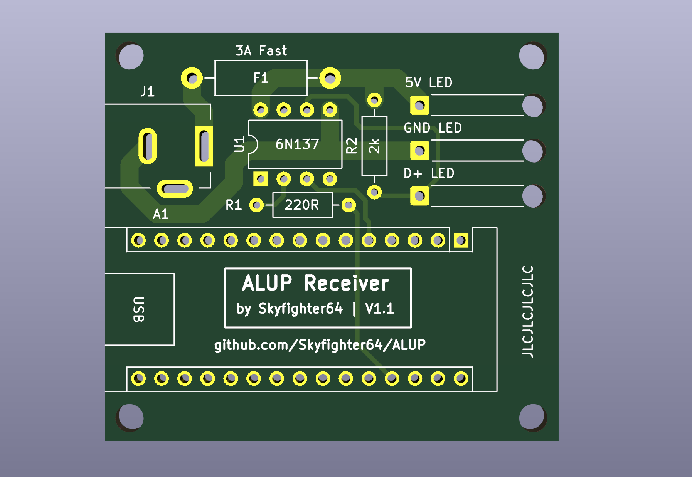

# Arduino-ALUP-Receiver
This repository contains Ki-CAD design files for the PCB of my Arduino ALUP Receiver hardware.

## Overview
The circuit uses an optocoupler to galvanically isolate the Arduino from the LED hardware.
This should prevent the connected USB-Device from frying if something goes wrong with the LEDs or the LED power supply.

Note that not any optocupler can be used, it has to be fast enough to support the communication speed of your LEDs (800Kbps for WS2812b, Spoiler: PC817s DON'T). 

There is also a 3A fuse included to protect the Power Supply from burning down due to overcurrent.
The number of connected LEDs should be limited so they don't pull more than 3A through the connected power supply.

## Disclaimer
The files provided are without any warranty or liability for any kind of damages. Building the device, following the provided instructions, operation of the device, and everything else is at your own risk. For more see license file.

## Bill Of Materials
Hardware Components needed for assembly:
- Arduino Nano (or clone)
- female pin headers for Arduino (optional but recommended)
- 6N137 Optocoupler
- 220 Ohm resistor
- 2kOhm resistor
- 3A THT Fuse
- DC barrel jack socket
- DC 5V, >= 3A Power Supply with barrel jack (Negative Outside, Positive Inside), (depends on number of LEDs)
- JST SM 3 Pin LED connector (depends on used LEDs)

## Building instructions
- Solder components to the PCB.
    1. Start with soldering the Optocoupler. The correct orientation is marked on the PCB.
    2. Continue with resistors and power jack socket according to the prints on the PCB.
    3. Solder the fuse
    4. Solder the JST connector. Usual wiring is 5V:Red, GND: White, D+: Green (May differ depending on LED strips). The cables can be looped through the three marked holes for some pull-protection.
    5. Solder the arduino (or female pin headers) to the PCB in the marked orientation.  

## Software
To install Arduino-ALUP, see [here](https://github.com/Skyfighter64/Arduino-ALUP)
Note: The LEDs are connected to GPIO 2 of the Arduino Board.